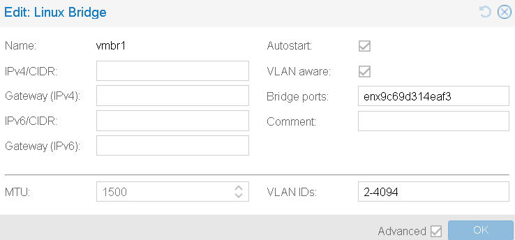
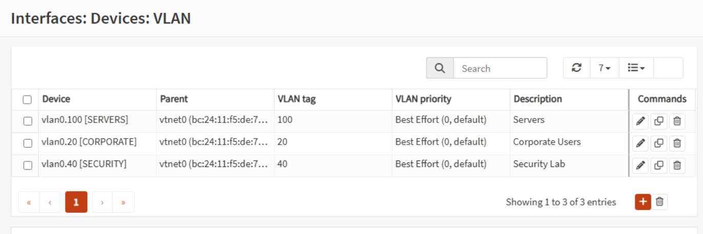
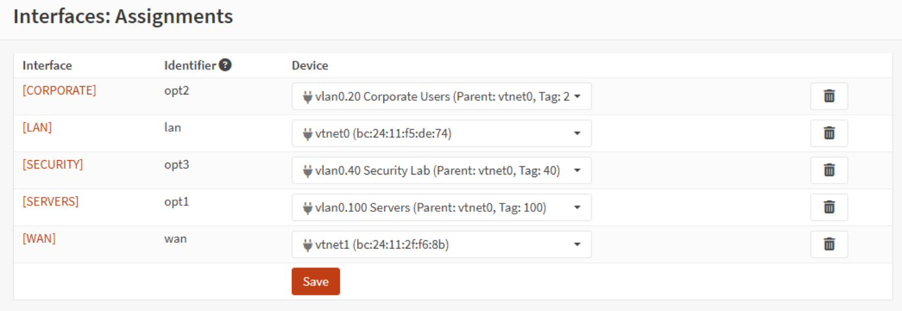
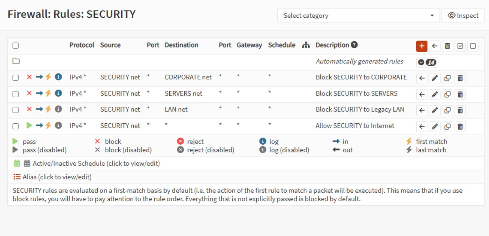
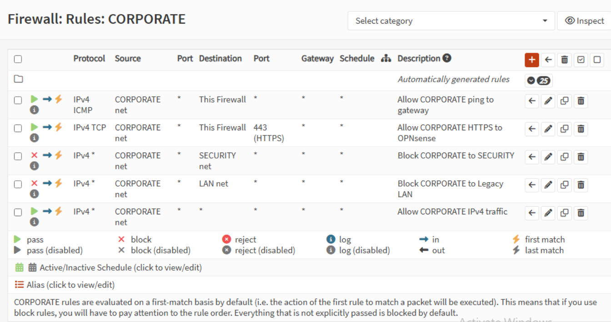
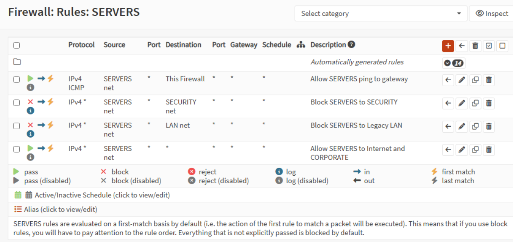
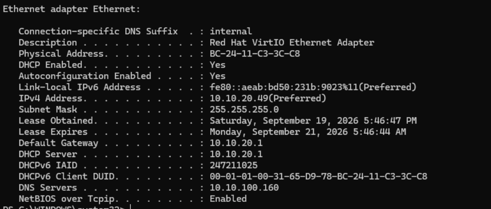
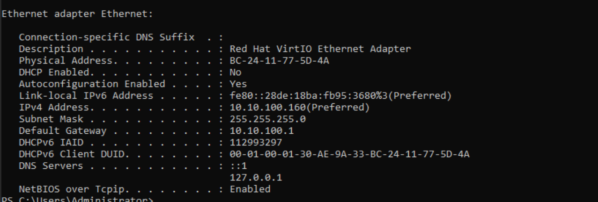
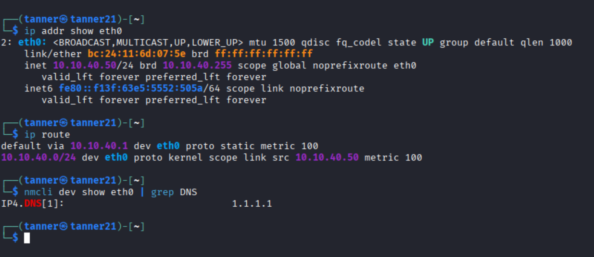
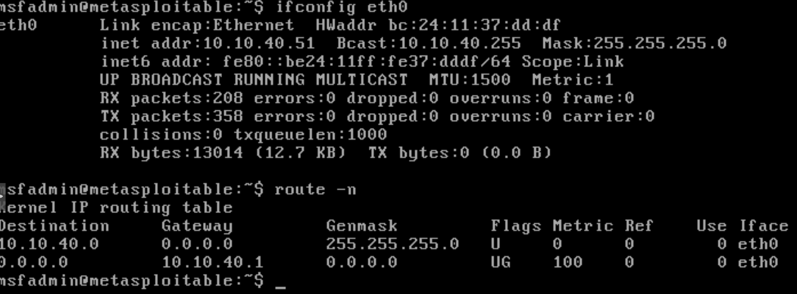

# Enterprise Network Homelab

## Freitag Financial Services (FFS)

This project simulates a small enterprise network built in my home lab using Proxmox, OPNsense, Windows Server, Windows 11, Kali Linux, and Metasploitable.

The goal was to take an initially flat network and redesign it into a segmented environment using VLANs, firewall policies, DHCP, DNS, and Active Directory.

Rather than simply creating separate subnets, I configured and tested communication policies between Corporate, Server, and Security networks. The Security VLAN contains intentionally untrusted systems and is isolated from the production-style Corporate and Server networks.

## Project Goals

- Segment a flat network using 802.1Q VLANs
- Configure inter-VLAN routing through OPNsense
- Implement firewall rules between security zones
- Maintain Active Directory and DNS functionality across VLANs
- Provide DHCP addressing to Corporate clients
- Isolate Kali Linux and Metasploitable from production-style systems
- Maintain Internet connectivity where appropriate
- Test and validate the final network design
- Troubleshoot real configuration and service conflicts encountered during implementation

## Network Topology

## Network Architecture

The environment is divided into separate network segments based on system role and trust level. OPNsense provides inter-VLAN routing and enforces firewall policy between the networks.

| VLAN | Name | Subnet | Gateway | Purpose |
|---|---|---|---|---|
| 20 | Corporate | 10.10.20.0/24 | 10.10.20.1 | Domain-joined user workstations |
| 40 | Security | 10.10.40.0/24 | 10.10.40.1 | Isolated security testing environment |
| 100 | Servers | 10.10.100.0/24 | 10.10.100.1 | Active Directory, DNS, and server infrastructure |
| Untagged | Legacy / Management | 10.10.10.0/24 | 10.10.10.1 | Legacy management and recovery network |

### Key Systems

| System | Role | Network | IP Address |
|---|---|---|---|
| OPNsense | Router / Firewall | Multiple VLANs | .1 gateway on each subnet |
| Windows Server 2022 | Domain Controller / DNS | Servers | 10.10.100.160 |
| CLIENT01 | Windows 11 domain workstation | Corporate | DHCP / 10.10.20.49 during testing |
| Kali Linux | Security testing workstation | Security | 10.10.40.50 |
| Metasploitable 2 | Intentionally vulnerable test target | Security | 10.10.40.51 |
| Proxmox VE | Virtualization host | Home / Management | 192.168.1.25 |

## Segmentation Policy

The Security VLAN is treated as an untrusted testing environment. Kali Linux and Metasploitable can communicate with each other for security labs, but OPNsense prevents the Security VLAN from initiating connections to the Corporate, Server, and Legacy networks.

| Source | Corporate | Servers | Security | Internet |
|---|---|---|---|---|
| Corporate | — | Allowed | Blocked | Allowed |
| Servers | Allowed | — | Blocked | Allowed |
| Security | Blocked | Blocked | — | Allowed |

This design allows normal Corporate-to-Server communication for services such as Active Directory and DNS while keeping intentionally vulnerable and offensive-security systems separated from the production-style environment.

## Implementation

### 1. Proxmox VLAN Infrastructure

Proxmox VE hosts the virtualized lab environment. The internal lab bridge, `vmbr1`, was configured as a VLAN-aware Linux bridge so tagged traffic could be carried between virtual machines and the OPNsense firewall.

OPNsense's internal virtual NIC acts as the VLAN trunk, carrying VLANs 20, 40, and 100 between Proxmox and OPNsense.

### 2. OPNsense VLANs and Routing

802.1Q VLAN interfaces were created in OPNsense for the three primary network segments:

- VLAN 20 — Corporate
- VLAN 40 — Security
- VLAN 100 — Servers

Each VLAN was assigned an OPNsense interface with a `.1` gateway address. OPNsense provides routing between the networks while firewall rules determine which traffic is permitted to cross security boundaries.

### 3. Firewall Segmentation

Firewall policies were designed around the trust level and role of each network.

The Security VLAN contains Kali Linux and Metasploitable and is treated as untrusted. It can reach the Internet for updates and lab activities but cannot initiate connections to the Corporate, Server, or Legacy networks.

Corporate systems can communicate with the Server VLAN for services such as Active Directory and DNS while access to the Security environment is blocked.

The Server VLAN can communicate with legitimate Corporate systems while remaining isolated from the Security environment.

### 4. Endpoint and Server Configuration

CLIENT01 receives its VLAN 20 addressing through DHCP and uses the Windows Server on VLAN 100 for Active Directory DNS.

The Windows Server 2022 domain controller uses a static address of `10.10.100.160` on the Server VLAN and provides Active Directory and DNS services for the lab.

### 5. Isolated Security Lab

Kali Linux and Metasploitable 2 were placed together on VLAN 40. This allows offensive-security exercises between the two systems without placing the intentionally vulnerable target on the Corporate or Server networks.

Kali uses the static address `10.10.40.50` and an external DNS resolver so it does not require DNS access to the domain controller.

Metasploitable uses the persistent static address `10.10.40.51`.

