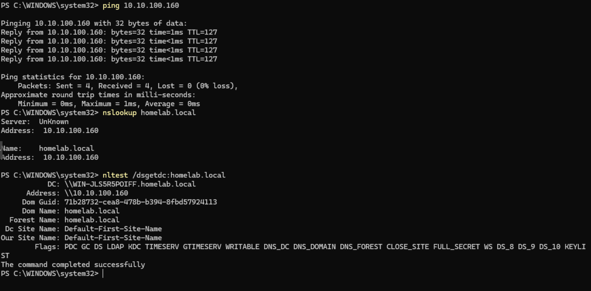
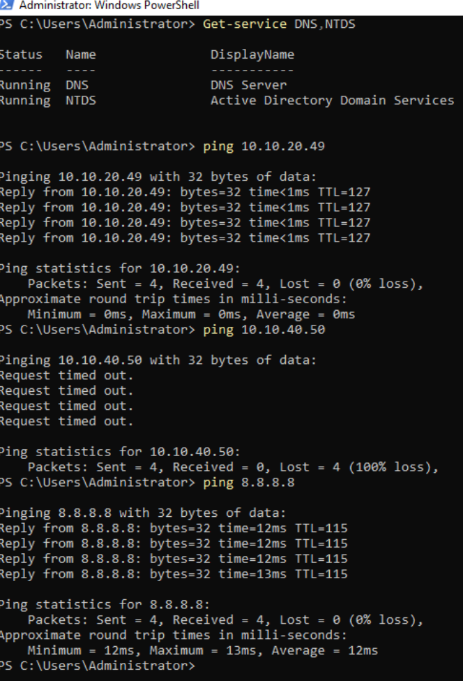
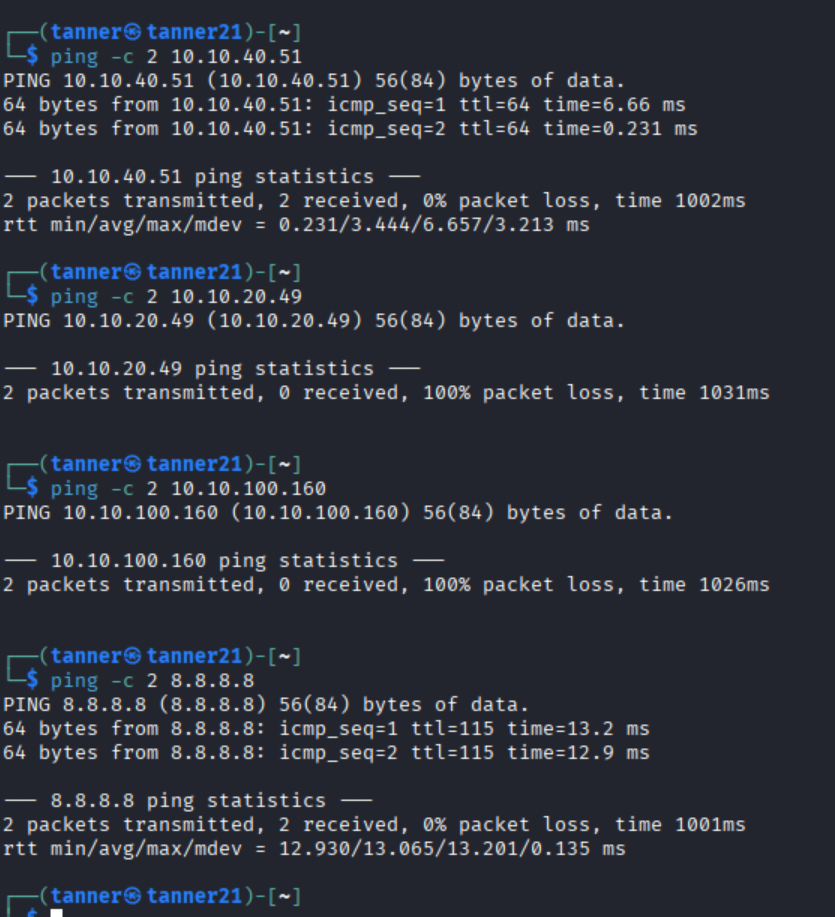

# Enterprise Network Homelab
**Proxmox | OPNsense | VLANs | Active Directory | DNS | DHCP | Windows Server | Kali Linux**

## Freitag Financial Services (FFS)

This project simulates a small enterprise network built in my home lab using Proxmox, OPNsense, Windows Server, Windows 11, Kali Linux, and Metasploitable.

The goal was to take an initially flat network and redesign it into a segmented environment using VLANs, firewall policies, DHCP, DNS, and Active Directory.

Rather than simply creating separate subnets, I configured and tested communication policies between Corporate, Server, and Security networks. The Security VLAN contains intentionally untrusted systems and is isolated from the production-style Corporate and Server networks.

## Project Goals

- Segment a flat network using 802.1Q VLANs
- Configure inter-VLAN routing through OPNsense
- Implement firewall rules between security zones
- Maintain Active Directory and DNS functionality across VLANs
- Provide DHCP addressing to Corporate clients
- Isolate Kali Linux and Metasploitable from production-style systems
- Maintain Internet connectivity where appropriate
- Test and validate the final network design
- Troubleshoot real configuration and service conflicts encountered during implementation

## Network Topology

## Network Architecture

The environment is divided into separate network segments based on system role and trust level. OPNsense provides inter-VLAN routing and enforces firewall policy between the networks.

| VLAN | Name | Subnet | Gateway | Purpose |
|---|---|---|---|---|
| 20 | Corporate | 10.10.20.0/24 | 10.10.20.1 | Domain-joined user workstations |
| 40 | Security | 10.10.40.0/24 | 10.10.40.1 | Isolated security testing environment |
| 100 | Servers | 10.10.100.0/24 | 10.10.100.1 | Active Directory, DNS, and server infrastructure |
| Untagged | Legacy / Management | 10.10.10.0/24 | 10.10.10.1 | Legacy management and recovery network |

### Key Systems

| System | Role | Network | IP Address |
|---|---|---|---|
| OPNsense | Router / Firewall | Multiple VLANs | .1 gateway on each subnet |
| Windows Server 2022 | Domain Controller / DNS | Servers | 10.10.100.160 |
| CLIENT01 | Windows 11 domain workstation | Corporate | DHCP / 10.10.20.49 during testing |
| Kali Linux | Security testing workstation | Security | 10.10.40.50 |
| Metasploitable 2 | Intentionally vulnerable test target | Security | 10.10.40.51 |
| Proxmox VE | Virtualization host | Home / Management | 192.168.1.25 |

## Segmentation Policy

The Security VLAN is treated as an untrusted testing environment. Kali Linux and Metasploitable can communicate with each other for security labs, but OPNsense prevents the Security VLAN from initiating connections to the Corporate, Server, and Legacy networks.

| Source | Corporate | Servers | Security | Internet |
|---|---|---|---|---|
| Corporate | — | Allowed | Blocked | Allowed |
| Servers | Allowed | — | Blocked | Allowed |
| Security | Blocked | Blocked | — | Allowed |

This design allows normal Corporate-to-Server communication for services such as Active Directory and DNS while keeping intentionally vulnerable and offensive-security systems separated from the production-style environment.

## Implementation

### 1. Proxmox VLAN Infrastructure

Proxmox VE hosts the virtualized lab environment. The internal lab bridge, `vmbr1`, was configured as a VLAN-aware Linux bridge so tagged traffic could be carried between virtual machines and the OPNsense firewall.

OPNsense's internal virtual NIC acts as the VLAN trunk, carrying VLANs 20, 40, and 100 between Proxmox and OPNsense.

### 2. OPNsense VLANs and Routing

802.1Q VLAN interfaces were created in OPNsense for the three primary network segments:

- VLAN 20 — Corporate
- VLAN 40 — Security
- VLAN 100 — Servers

Each VLAN was assigned an OPNsense interface with a `.1` gateway address. OPNsense provides routing between the networks while firewall rules determine which traffic is permitted to cross security boundaries.

### 3. Firewall Segmentation

Firewall policies were designed around the trust level and role of each network.

The Security VLAN contains Kali Linux and Metasploitable and is treated as untrusted. It can reach the Internet for updates and lab activities but cannot initiate connections to the Corporate, Server, or Legacy networks.

Corporate systems can communicate with the Server VLAN for services such as Active Directory and DNS while access to the Security environment is blocked.

The Server VLAN can communicate with legitimate Corporate systems while remaining isolated from the Security environment.

### 4. Endpoint and Server Configuration

CLIENT01 receives its VLAN 20 addressing through DHCP and uses the Windows Server on VLAN 100 for Active Directory DNS.

The Windows Server 2022 domain controller uses a static address of `10.10.100.160` on the Server VLAN and provides Active Directory and DNS services for the lab.

### 5. Isolated Security Lab

Kali Linux and Metasploitable 2 were placed together on VLAN 40. This allows offensive-security exercises between the two systems without placing the intentionally vulnerable target on the Corporate or Server networks.

Kali uses the static address `10.10.40.50` and an external DNS resolver so it does not require DNS access to the domain controller.

Metasploitable uses the persistent static address `10.10.40.51`.

## Testing and Validation

After implementation, connectivity and isolation tests were performed from each primary network to verify that the firewall policy matched the intended design.

### Corporate VLAN Validation

CLIENT01 on VLAN 20 was tested to verify that a Corporate workstation could:

- Reach its OPNsense gateway
- Communicate with the domain controller on VLAN 100
- Resolve public DNS names
- Resolve the `homelab.local` Active Directory domain
- Discover the domain controller
- Access the Internet
- Remain isolated from the Security VLAN

Domain controller discovery was verified using `nltest`, while DNS functionality was tested using `nslookup`.

### Server VLAN Validation

The Windows Server 2022 domain controller was tested to verify that Active Directory and DNS remained operational after migration to VLAN 100.

The server successfully communicated with Corporate systems and the Internet while connections initiated toward the Security VLAN were blocked.

### Security VLAN Isolation

Kali Linux was used to verify the Security VLAN policy.

Testing confirmed that Kali could communicate with Metasploitable on the same Security VLAN and reach the Internet, while attempts to reach Corporate and Server systems were blocked by OPNsense.

### Validation Results

| Test | Expected | Result |
|---|---|---|
| Corporate → Server/DC | Allowed | Pass |
| Corporate → Security | Blocked | Pass |
| Corporate → Internet | Allowed | Pass |
| Corporate → AD DNS | Allowed | Pass |
| Corporate → Domain Controller discovery | Allowed | Pass |
| Server → Corporate | Allowed | Pass |
| Server → Security | Blocked | Pass |
| Server → Internet | Allowed | Pass |
| Security → Corporate | Blocked | Pass |
| Security → Servers | Blocked | Pass |
| Security → Internet | Allowed | Pass |
| Kali → Metasploitable | Allowed | Pass |

The final validation confirmed that the VLAN and firewall design enforced the intended trust boundaries without disrupting required Active Directory, DNS, or Internet connectivity.

## Troubleshooting

Several issues occurred during implementation that required troubleshooting across the virtualization, networking, and service layers.

### Issue 1 — VLAN Traffic Was Not Reaching OPNsense

#### Problem

During initial VLAN testing, Kali was configured for VLAN 100 with an address in the `10.10.100.0/24` network but could not reach the VLAN gateway at `10.10.100.1`.

Neighbor discovery showed the gateway as incomplete, indicating that basic Layer 2 communication was failing.

#### Investigation

I worked through the path one layer at a time rather than immediately changing firewall rules.

Troubleshooting included:

- Verifying Kali's IP address, subnet mask, and gateway
- Verifying the Proxmox VM NIC was tagged for VLAN 100
- Checking OPNsense packet captures for incoming VLAN traffic
- Inspecting Proxmox VLAN membership with `bridge vlan show`
- Using `tcpdump` to verify tagged VLAN 100 traffic on the bridge
- Comparing VLAN membership between the Kali and OPNsense virtual interfaces

The packet capture showed VLAN-tagged traffic reaching the Proxmox bridge, but the OPNsense virtual NIC was not configured to carry the required VLAN tags.

#### Resolution

The OPNsense internal virtual NIC was configured as a VLAN trunk carrying the required VLAN IDs.

After correcting the trunk configuration, VLAN 100 traffic successfully reached OPNsense and Kali could communicate with the VLAN gateway.

#### Lesson Learned

A VLAN-aware bridge alone does not guarantee that every connected virtual interface is carrying the required VLAN traffic. Troubleshooting the complete Layer 2 path helped isolate the problem before making unnecessary routing or firewall changes.

---

### Issue 2 — DHCP Service Conflict

#### Problem

During the Corporate VLAN migration, CLIENT01 failed to receive a valid DHCP lease and assigned itself an APIPA `169.254.x.x` address.

This prevented normal network communication even though the VLAN and routing configuration appeared correct.

#### Investigation

Instead of treating the problem as a VLAN failure, I checked the DHCP service itself.

OPNsense reported that the ISC DHCP service could not bind to the DHCP address because the address was already in use.

I then checked which process was listening on UDP port 67 and found that Dnsmasq was already providing DHCP services.

This revealed that two DHCP services were attempting to use the same port.

#### Resolution

I standardized DHCP on Dnsmasq rather than running competing DHCP services.

A Corporate DHCP range was configured for VLAN 20 along with the appropriate options:

- Gateway: `10.10.20.1`
- DNS server: `10.10.100.160`
- Address range: `10.10.20.2 - 10.10.20.100`

After renewing the lease, CLIENT01 received a valid `10.10.20.x` address and regained network, DNS, Active Directory, and Internet connectivity.

#### Lesson Learned

An APIPA address does not automatically mean the VLAN or switch configuration is broken. Verifying DHCP service status and checking which process owns the required port can quickly distinguish a service-layer problem from a network-layer problem.

---

### Issue 3 — Firewall Rule Inversion

#### Problem

While creating a rule to block Corporate systems from the Legacy network, required connectivity to the Server VLAN and Internet unexpectedly stopped while the Legacy gateway remained reachable.

#### Investigation

Reviewing the OPNsense rule showed that the **Destination / Invert** option had accidentally been enabled.

Instead of blocking traffic to `LAN net`, the rule was effectively matching traffic destined for anything **except** `LAN net`.

#### Resolution

I removed the destination inversion and reapplied the firewall policy.

Corporate systems retained access to required Server and Internet resources while the intended Legacy-network restriction remained in place.

#### Lesson Learned

Small firewall-rule options can dramatically change policy behavior. When a firewall change causes unexpected connectivity loss, verify the exact source, destination, inversion settings, and rule order before changing unrelated network components.

## Technologies Used

- **Proxmox VE** — Virtualization platform and virtual networking
- **OPNsense** — Routing, VLAN interfaces, DHCP, and firewall policy
- **Windows Server 2022** — Active Directory Domain Services and DNS
- **Windows 11** — Domain-joined Corporate workstation
- **Kali Linux** — Security testing workstation
- **Metasploitable 2** — Intentionally vulnerable security testing target
- **Dnsmasq** — DHCP services for network clients
- **802.1Q VLANs** — Network segmentation
- **Linux networking tools** — `ip`, `nmcli`, `tcpdump`, `bridge`, `ping`, and `nslookup`
- **Windows networking tools** — `ipconfig`, `ping`, `nslookup`, `nltest`, and PowerShell

## Skills Demonstrated

This project provided hands-on experience with:

- Network architecture and subnet planning
- VLAN configuration and 802.1Q trunking
- Inter-VLAN routing
- Firewall rule design and traffic segmentation
- DHCP configuration and troubleshooting
- DNS configuration and troubleshooting
- Windows Server administration
- Active Directory networking
- Linux network configuration
- Proxmox virtual networking
- Network traffic analysis
- Layer 2 and Layer 3 troubleshooting
- Service and port conflict troubleshooting
- Connectivity and security-policy validation
- Technical documentation

## Future Improvements

The environment can be expanded in future projects without adding unnecessary complexity to the current implementation. Potential improvements include:

- Dedicated IT/Admin VLAN
- Guest network with Internet-only access
- Centralized logging and monitoring
- IDS/IPS deployment
- SIEM integration
- Additional Windows and Linux servers
- More granular firewall policies
- Automated configuration or validation using PowerShell, Bash, or Python
- Azure/Entra ID integration

## Project Outcome

The original flat homelab was redesigned into a segmented small-enterprise environment with separate Corporate, Server, and Security networks.

The final environment maintains required Active Directory, DNS, DHCP, and Internet functionality while isolating intentionally vulnerable security-testing systems from production-style resources.

More importantly, the project required troubleshooting across multiple layers of the environment, including VLAN trunking, DHCP service conflicts, and firewall policy behavior. The completed lab provides a foundation for future networking, systems administration, cybersecurity, and automation projects.
