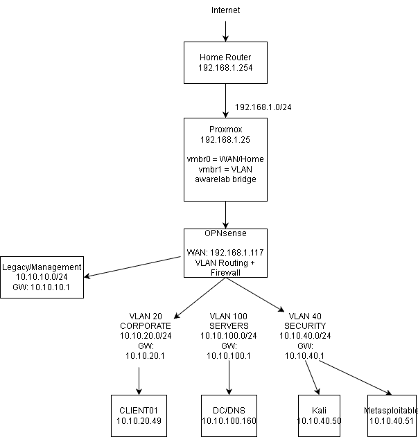

# Enterprise Network Homelab

## Freitag Financial Services (FFS)

This project simulates a small enterprise network built in my home lab using Proxmox, OPNsense, Windows Server, Windows 11, Kali Linux, and Metasploitable.

The goal was to take an initially flat network and redesign it into a segmented environment using VLANs, firewall policies, DHCP, DNS, and Active Directory.

Rather than simply creating separate subnets, I configured and tested communication policies between Corporate, Server, and Security networks. The Security VLAN contains intentionally untrusted systems and is isolated from the production-style Corporate and Server networks.

## Project Goals

- Segment a flat network using 802.1Q VLANs
- Configure inter-VLAN routing through OPNsense
- Implement firewall rules between security zones
- Maintain Active Directory and DNS functionality across VLANs
- Provide DHCP addressing to Corporate clients
- Isolate Kali Linux and Metasploitable from production-style systems
- Maintain Internet connectivity where appropriate
- Test and validate the final network design
- Troubleshoot real configuration and service conflicts encountered during implementation

## Network Topology

## Network Architecture

The environment is divided into separate network segments based on system role and trust level. OPNsense provides inter-VLAN routing and enforces firewall policy between the networks.

| VLAN | Name | Subnet | Gateway | Purpose |
|---|---|---|---|---|
| 20 | Corporate | 10.10.20.0/24 | 10.10.20.1 | Domain-joined user workstations |
| 40 | Security | 10.10.40.0/24 | 10.10.40.1 | Isolated security testing environment |
| 100 | Servers | 10.10.100.0/24 | 10.10.100.1 | Active Directory, DNS, and server infrastructure |
| Untagged | Legacy / Management | 10.10.10.0/24 | 10.10.10.1 | Legacy management and recovery network |

### Key Systems

| System | Role | Network | IP Address |
|---|---|---|---|
| OPNsense | Router / Firewall | Multiple VLANs | .1 gateway on each subnet |
| Windows Server 2022 | Domain Controller / DNS | Servers | 10.10.100.160 |
| CLIENT01 | Windows 11 domain workstation | Corporate | DHCP / 10.10.20.49 during testing |
| Kali Linux | Security testing workstation | Security | 10.10.40.50 |
| Metasploitable 2 | Intentionally vulnerable test target | Security | 10.10.40.51 |
| Proxmox VE | Virtualization host | Home / Management | 192.168.1.25 |

## Segmentation Policy

The Security VLAN is treated as an untrusted testing environment. Kali Linux and Metasploitable can communicate with each other for security labs, but OPNsense prevents the Security VLAN from initiating connections to the Corporate, Server, and Legacy networks.

| Source | Corporate | Servers | Security | Internet |
|---|---|---|---|---|
| Corporate | — | Allowed | Blocked | Allowed |
| Servers | Allowed | — | Blocked | Allowed |
| Security | Blocked | Blocked | — | Allowed |

This design allows normal Corporate-to-Server communication for services such as Active Directory and DNS while keeping intentionally vulnerable and offensive-security systems separated from the production-style environment.
